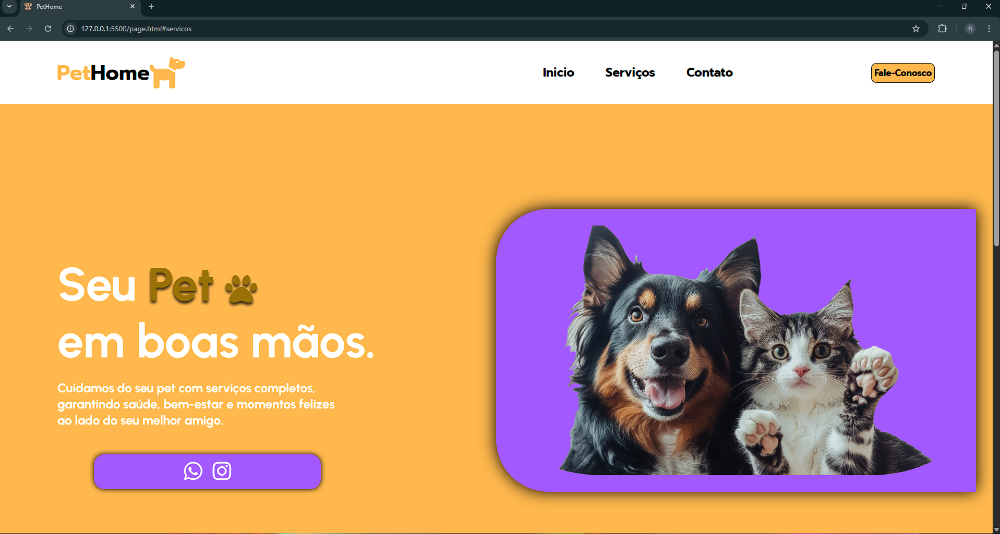
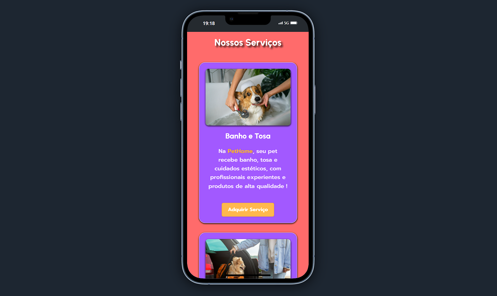
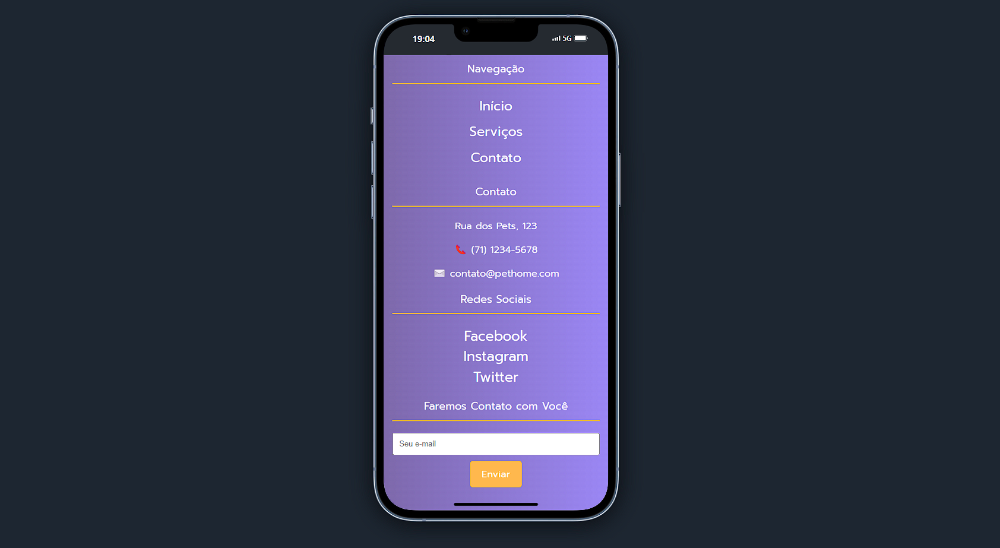

# 🐾 PetHome - Página de Petshop

Bem-vindo ao **PetHome**, um projeto de uma página moderna e responsiva para um petshop. Este site tem como objetivo apresentar os principais serviços de um petshop fictício, de forma atrativa, acessível e funcional.

## 📸 Visão Geral

A página conta com:

- **Layout moderno e responsivo**
- **Navegação fluida entre seções**
- **Serviços destacados com imagens**
- **Botões de ação e contato**
- **Integração com ícones de redes sociais**
- **Rodapé completo com informações e formulário de e-mail**

## 🖼️ Fotos do Projeto

- 
- 
- 

## 🚀 Tecnologias Utilizadas

- **HTML5** para estruturação
- **CSS3** para estilização
- **JavaScript** (ScrollReveal) para animações de scroll
- **Font Awesome** para ícones
- **Responsividade** com uso de media queries

## 🧩 Estrutura do Projeto

```
PetHome/
│
├── index.html                # Página principal
├── style/
│   └── page.css              # Estilos da página
├── js/
│   └── page.js               # Scripts JS e animações
├── img/
│   ├── favicon.ico           # Ícone da aba
│   ├── pet-inicio.png        # Imagem da seção inicial
│   ├── pet-banho.jpg         # Imagem do serviço de banho e tosa
│   ├── pet-trasnport.jpg     # Imagem do serviço de táxi pet
│   ├── pet-vet.jpg           # Imagem do serviço de consulta veterinária
│   ├── telaServiços.png      # Imagem da tela de serviços
│   ├── telaPrincipal.png     # Imagem da tela principal
│   └── telaContato.png       # Imagem da tela de contato

```

## 📞 Contato

Caso queira saber mais ou sugerir melhorias, entre em contato:

- ✉️ ryaanfeliipe22@gmail.com
- 📱 https://www.linkedin.com/in/ryanfelipedecarvalho/

## 📌 Status do Projeto

✅ Finalizado – pronto para visualização e uso como modelo ou base para projetos futuros.
